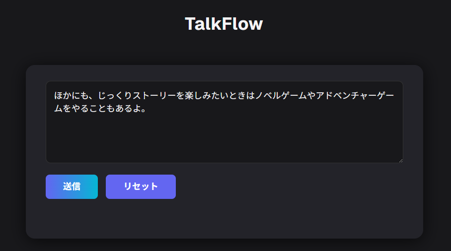
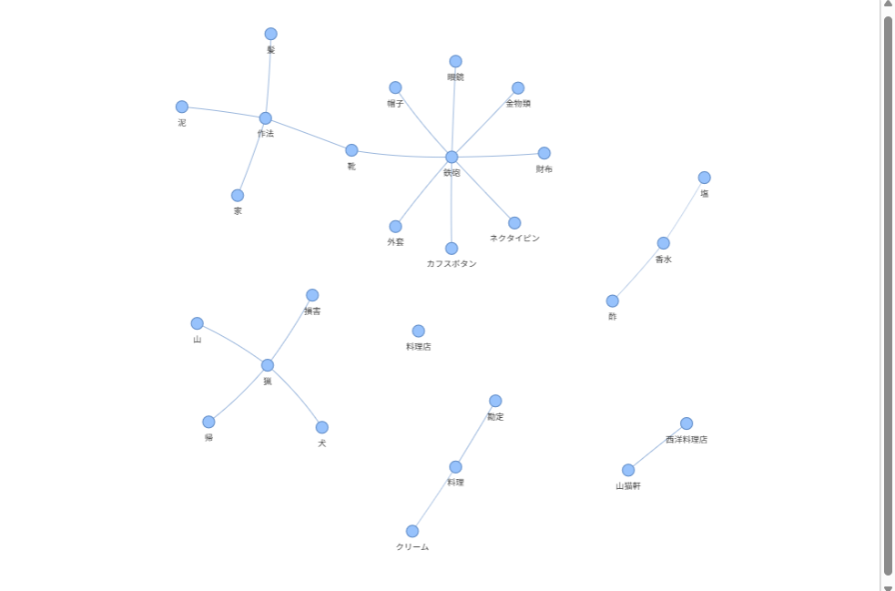

# TalkFlow

## Overview

TalkFlow visualizes the "topics" within conversations or text as a graph network, making the flow of discussion instantly clear.

### Possible Use Cases
- Joining a livestream midway and not understanding the conversation flow — use TalkFlow to catch up.
- Meetings where topics keep shifting — use TalkFlow to organize and track discussions.
- Reading a novel but forgot what happened earlier — use TalkFlow to recall previous topics.

---

## Example


- You can input conversation text via the textbox and submit it.
- Voice input is planned for future support.


- Submitting multiple messages will generate and update the graph.
- The example shown is based on [DemoTalk](DemoTalk.md).
- The graph reveals that the conversation developed starting from the topic "game."
- The most recently added nodes are displayed in red.

---

## Tech Stack

- Next.js
  - React
  - TypeScript
- Python
  - Flask
- Docker  
- Gemini API

---

## Getting Started

```shell
still preparing ...
```
