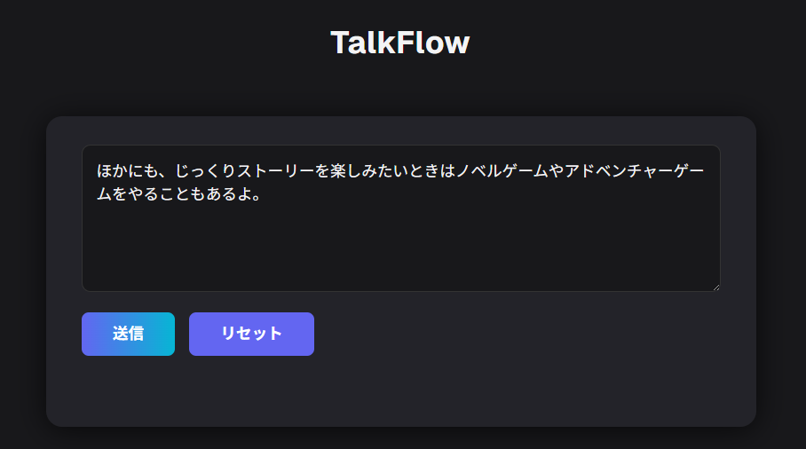
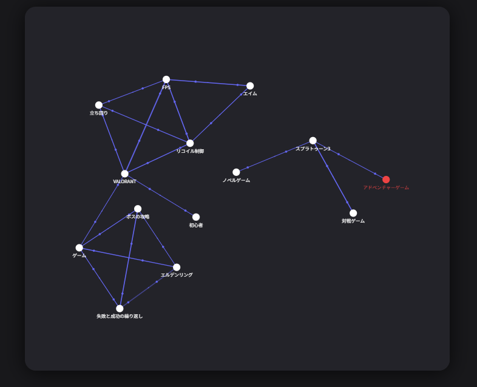
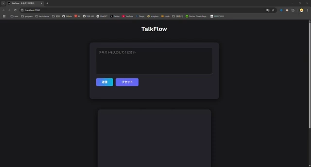

# TalkFlow

## Overview

TalkFlow visualizes the "topics" within conversations or text as a graph network, making the flow of discussion instantly clear.

### Possible Use Cases
- Joining a livestream midway and not understanding the conversation flow — use TalkFlow to catch up.
- Meetings where topics keep shifting — use TalkFlow to organize and track discussions.
- Reading a novel but forgot what happened earlier — use TalkFlow to recall previous topics.

## Example


- You can input conversation text via the textbox and submit it.
- Voice input is planned for future support.


- Submitting multiple messages will generate and update the graph.
- The example shown is based on [DemoTalk](DemoTalk.md).
- The graph reveals that the conversation developed starting from the topic "game."
- The most recently added nodes are displayed in red.

(https://youtu.be/EIENG8IBCYY?si=RSVGAbZTRdKKMcAP)

## Tech Stack

- Next.js (React, TypeScript)
- Python (Flask)
- Docker
- Gemini API

## Getting Started

1. **Set up your API key:**  
   Create a file named `.env` in the `app/` directory and add your Gemini API key:
   ```env
   GENAI_API_KEY=your_api_key_here
   ```

2. **Build and start the app:**
   ```shell
   docker compose up --build
   ```

3. **Access the app:**  
   Open http://localhost:3000 in your browser.

## Features

- Real-time topic graph visualization
- AI-powered topic extraction (Gemini API)
- Voice input planned for future support
